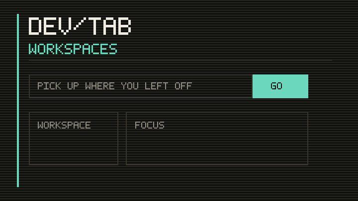

# DevTab

DevTab is a keyboard-first, developer-focused new-tab dashboard built for
[Hack Club Stardance](https://stardance.hackclub.com/). It combines search,
commands, live information, bookmarks, and local Markdown notes in one fast,
customizable workspace.

**Live site:** [caleb-guyer.github.io/DevTab](https://caleb-guyer.github.io/DevTab/)



## Features

### Search and command launcher

- Search with Google, DuckDuckGo, GitHub, or MDN
- Open pasted URLs directly
- Open the command launcher with `Ctrl/Cmd + K` or by typing `>`
- Search GitHub or MDN, open saved links, append notes, change appearance, and
  calculate arithmetic from commands

| Command | Example |
| --- | --- |
| `gh <query>` | `gh DevTab` |
| `mdn <query>` | `mdn grid` |
| `open <link>` | `open Vite` |
| `note <text>` | `note finish extension docs` |
| `theme <value>` | `theme amber` |
| `calc <expression>` | `calc (48 * 12) / 3` |

### Custom dashboard

- Add, edit, delete, and reorder quick links
- Reorder dashboard cards by dragging their handles or using `Alt + Arrow`
- Show or hide individual cards
- Choose the accent color, background intensity, search engine, and dark,
  light, or system mode
- Select standard or high contrast and full, reduced, or system motion
- Export the complete dashboard as JSON and import it on another device
- Reset one preference group without resetting the rest of DevTab

### Weather

- Use browser geolocation or enter a city manually
- Select automatic, Fahrenheit, or Celsius units
- View live temperature, condition, location, and weather symbol
- Fall back to the last successful result when the network is unavailable

Weather and city search are provided by
[Open-Meteo](https://open-meteo.com/). Automatic location names use
[BigDataCloud](https://www.bigdatacloud.com/).

### GitHub

- View public profile, repository, follower, and open-item counts
- Browse recently updated repositories with language, stars, open issues, and
  update time
- Filter repositories and save local favorites
- View recent public GitHub events
- Open common GitHub actions quickly
- Continue showing the last successful response during API or network failures

GitHub data comes from the public
[GitHub REST API](https://docs.github.com/en/rest) without an access token.

### Notes

- Create and search multiple named notes
- Automatically save notes in the browser
- Pin important notes
- Preview headings, bullets, code blocks, and interactive Markdown checklists
- View created and updated timestamps
- Download any note as a Markdown file

### Offline and extension support

- Cache the application shell with a service worker
- Cache the last successful weather and GitHub responses
- Install DevTab as a browser app from supported browsers
- Build an unpacked Manifest V3 extension that replaces the browser's new-tab
  page

## Keyboard shortcuts

| Key | Action |
| --- | --- |
| `/` | Focus search |
| `N` | Show and focus notes |
| `T` | Toggle dark or light mode |
| `Ctrl/Cmd + K` | Open the command launcher |
| `Alt + Arrow` | Move a dashboard card while its move control is focused |

Single-key shortcuts do not run while typing in an input, text area, or select.

## Technologies

- Semantic HTML5
- Custom CSS with responsive layouts and accessible appearance modes
- Vanilla JavaScript modules
- Browser `localStorage`, Cache API, and Service Worker API
- [Vite](https://vite.dev/) for development and builds
- Node's built-in test runner
- Lighthouse CI for automated performance and accessibility thresholds
- GitHub Actions and GitHub Pages for continuous deployment

## Local development

### Prerequisites

- [Node.js](https://nodejs.org/) 20.19 or newer
- npm, included with Node.js

### Setup

```bash
git clone https://github.com/Caleb-Guyer/DevTab.git
cd DevTab
npm install
npm run dev
```

Open the address printed in the terminal, normally `http://localhost:5173`.

On Windows PowerShell systems that block `npm.ps1`, use `npm.cmd` in place of
`npm`.

### Available commands

| Command | Purpose |
| --- | --- |
| `npm run dev` | Start the development server |
| `npm test` | Run state, command, URL, calculator, and Markdown tests |
| `npm run build` | Create the production website in `dist/` |
| `npm run build:extension` | Create the unpacked browser extension in `dist-extension/` |
| `npm run preview` | Preview the production website locally |
| `npm run audit` | Run Lighthouse CI checks |
| `npm run check` | Run tests and the production build |
| `npm run assets` | Regenerate icons, social preview, and demo media |

## Install as a browser extension

1. Run `npm install` and `npm run build:extension`.
2. Open the browser's extension management page.
3. Enable developer mode.
4. Choose **Load unpacked** and select the generated `dist-extension` folder.
5. Open a new tab.

Chrome and Edge use `chrome://extensions`. Firefox users can temporarily load
the generated `manifest.json` from `about:debugging`.

The extension requests geolocation only for automatic weather. Its API host
permissions are limited to Open-Meteo, BigDataCloud, and GitHub.

## Data and privacy

- Notes, links, favorites, and preferences remain in browser storage.
- Exported backups are created locally and downloaded by the browser.
- Location is requested only for automatic weather and can be replaced with a
  manually selected city.
- GitHub uses only public information and does not require authentication.
- No analytics or tracking scripts are included.

## Quality checks and deployment

The quality workflow runs automated tests, website and extension builds, and
Lighthouse thresholds on pushes and pull requests. Pushes to `main` also deploy
the production `dist/` directory to GitHub Pages through
`.github/workflows/deploy-pages.yml`.

## Project status

DevTab 2.0 is a complete local-first dashboard and browser new-tab extension.
